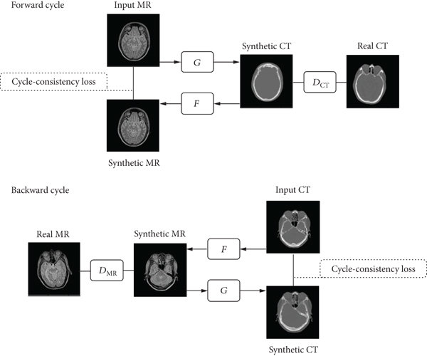
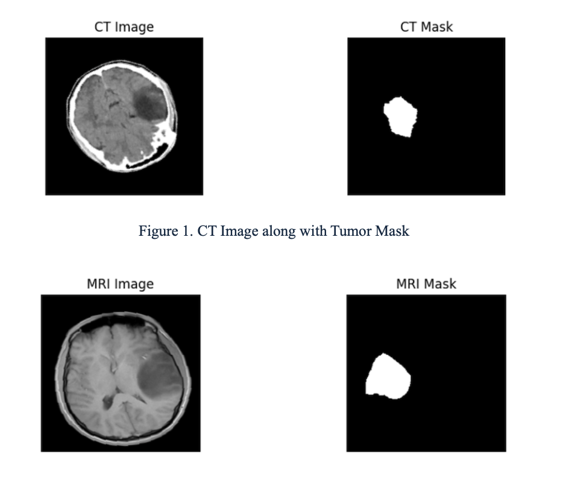
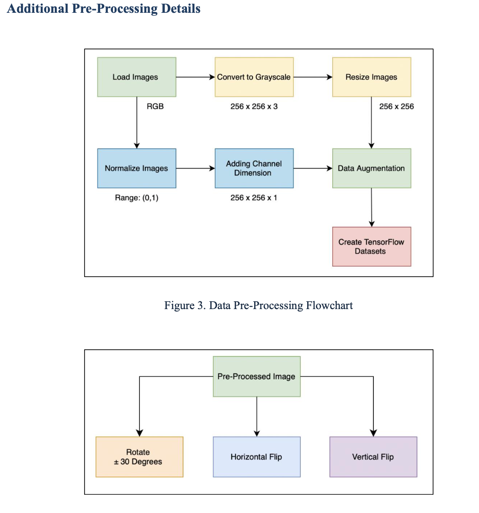
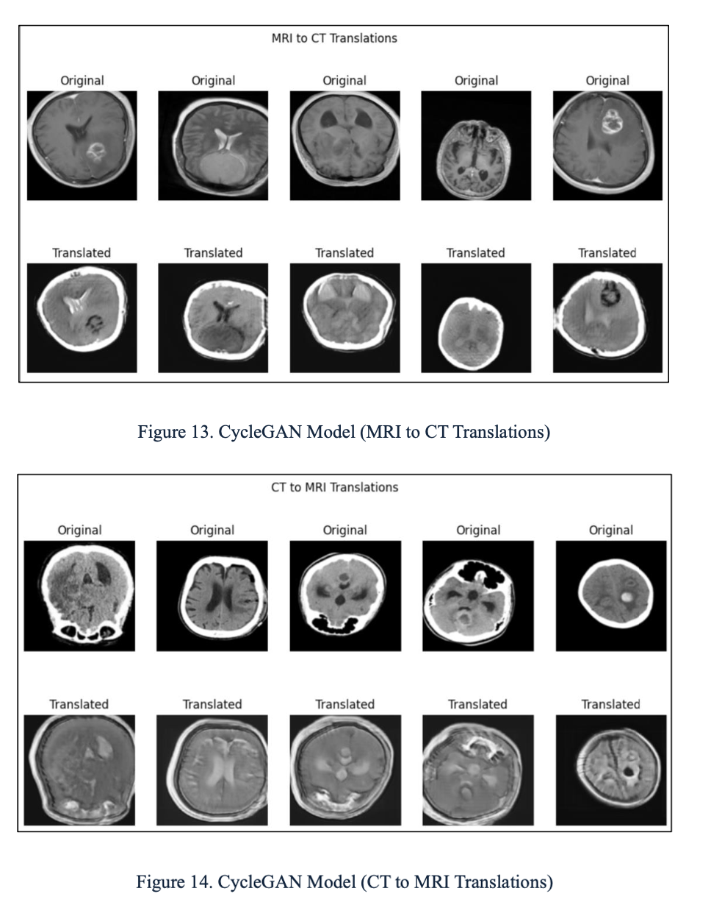
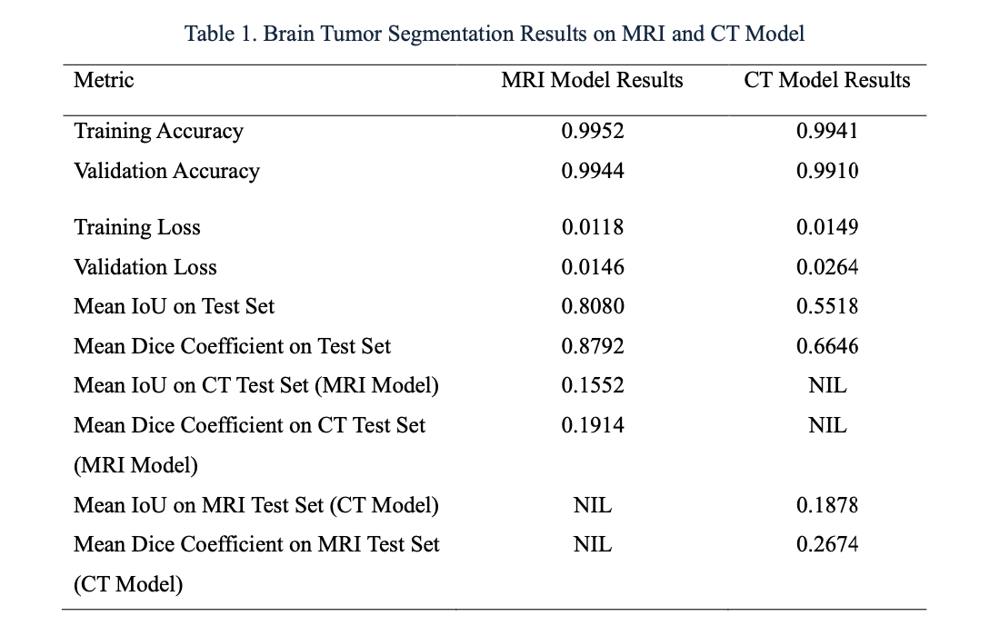

<h1 align="left">🧠 Unpaired MRI ↔ CT Image Translation for Brain Tumour Segmentation</h1>

A <b>CycleGAN-based</b> deep learning framework for unpaired MRI ↔ CT translation, reducing domain shift in medical imaging and improving brain tumour segmentation performance.

---

## 📖 Introduction

**Generative AI (GenAI)** is a branch of AI focused on creating new, realistic data — such as images, text, or audio — by learning the underlying patterns of existing data.  
In **medical imaging**, Generative AI can:

- Create **synthetic scans** to augment small datasets.
- Translate between modalities (e.g., MRI ↔ CT) for cross-domain applications.
- Improve model robustness and generalisation.

**Generative Adversarial Networks (GANs)** are a core GenAI technology, consisting of:

1. **Generator (G)** — Creates synthetic data.
2. **Discriminator (D)** — Distinguishes real from synthetic data.

They are trained together in an adversarial loop, where the generator improves at “fooling” the discriminator, and the discriminator improves at spotting fakes.

---

## 🔄 CycleGAN Overview

**CycleGAN** extends GANs for **unpaired image-to-image translation**, solving the problem of requiring paired datasets.  
It learns two mappings simultaneously:

- \( G_{MRI \to CT} \) — Translates MRI images to CT-like images.
- \( G_{CT \to MRI} \) — Translates CT images to MRI-like images.

**Key concepts in CycleGAN:**
- **Adversarial Loss** — Makes generated images realistic.
- **Cycle Consistency Loss** — Ensures \( MRI \to CT \to MRI \) returns the original MRI (and vice versa).
- **Identity Loss** — Prevents unnecessary changes when input is already in target domain.
- **SSIM Loss** — Preserves structural similarity.
- **Feature Adaptation Loss** — Aligns high-level features using pretrained networks.

  

---

## 📜 Problem Statement

- **MRI** — High soft-tissue contrast, better tumour visibility.
- **CT** — Faster, cheaper, better for bone structures.

**Domain shift problem:** Models trained on one modality perform poorly on the other due to differences in contrast, noise, and intensity distribution.  
**Challenge:** Paired MRI–CT datasets are rare and expensive to obtain.

**Our goal:** Develop an **unpaired translation model** that preserves anatomy while enabling **cross-modality segmentation**.

---

## 📂 Dataset

- **Source**: Jordan University Hospital (JUH)
- **Patients**: 20  
- **Images**: 178 axial 2D slices (90 MRI, 88 CT)  
- **Size**: 256 × 256  
- **Annotations**: Tumour masks by radiologists  
- **Setting**: MRI and CT are from different patients (unpaired)

  

---

## 🛠 Preprocessing Pipeline

1. **Convert to Grayscale** — Focus on structural details.  
2. **Resize to 256 × 256** — Standardise input size.  
3. **Normalise pixel values** — Range [0, 1].  
4. **Add channel dimension** — For model compatibility.  
5. **Data Augmentation**:
   - ±30° rotations  
   - Horizontal/vertical flips  
   - Contrast adjustments  

  

---

## 📋 Methodology

### **1️⃣ CycleGAN Translation**
- Two generators and discriminators for bidirectional mapping.
- Extra **SSIM loss** for structural preservation.
- **Feature adaptation** using pretrained ResNet/VGG to align domain features.

### **2️⃣ U-Net Segmentation**
- Standard U-Net with skip connections for tumour segmentation.
- Evaluates cross-modality generalisation with and without synthetic images.

---

## 🖼 Sample Translations

**Top:** MRI → CT  
**Bottom:** CT → MRI  

  

---

## 📊 Segmentation Results

  

**Key Observations:**
- Within-modality performance is strong (MRI Dice: **0.8792**, CT Dice: **0.6646**).
- Cross-modality performance drops significantly, confirming **domain shift**.
- **Feature adaptation + SSIM loss** improves CT→MRI SSIM from 0.360 (DiscoGAN) to **0.5285**.

---

## 📚 Key Takeaways

- **Generative AI** can effectively bridge modality gaps in medical imaging.  
- **CycleGAN** enables realistic, unpaired MRI ↔ CT translation while preserving anatomy.  
- **Structural similarity (SSIM) and feature adaptation** improve perceptual and quantitative quality.  
- Augmenting segmentation training with synthetic modalities can improve cross-domain performance.

---

## 📧 Contact

**Author:** Suchit Pathak  
📩 **Email:** suchitpathak0807@gmail.com  
💻 **GitHub:** [github.com/Suchit0807](https://github.com/Suchit0807)  
🌐 **Portfolio:** [suchit0807.github.io/suchit-portfolio](https://suchit0807.github.io/suchit-portfolio/)  
🌐 **LinkedIn:** [linkedin.com/in/suchitpathak](https://linkedin.com/in/suchitpathak)

---

**⭐ If you found this work useful, please consider starring the repo!**

