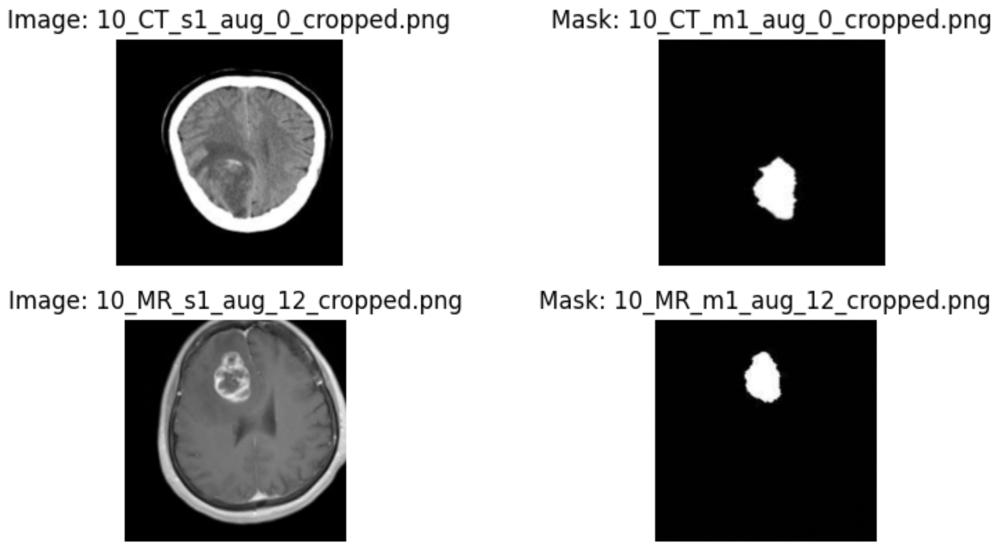

# 🧠 Unpaired MRI ↔ CT Image Translation for Brain Tumour Segmentation

_A deep learning framework using CycleGAN for unpaired MRI ↔ CT image translation, aimed at bridging modality gaps and enhancing cross-domain brain tumour segmentation._

---

## 📌 Problem Statement

Brain tumours are commonly diagnosed and monitored using **Magnetic Resonance Imaging (MRI)** and **Computed Tomography (CT)** scans. Each modality offers unique advantages:

- **MRI**: Superior soft-tissue contrast, clearer tumour boundaries, no ionising radiation.  
- **CT**: Faster acquisition, better for bone structures, more widely available in resource-limited settings.

However, models trained for tumour segmentation on one modality often perform poorly on the other due to **domain shift** — systematic differences in intensity distribution, texture, and contrast between modalities.

**Challenge:**
- Acquiring large-scale, *paired* MRI and CT datasets is impractical.
- Training separate models for each modality is resource-intensive.
- Direct cross-modality application leads to severe performance drops.

**Goal:**  
Develop an **unsupervised, two-way image translation pipeline** capable of:
1. Translating MRI ↔ CT without paired training data.
2. Preserving anatomical and structural details.
3. Improving segmentation performance across modalities.

---

## 📊 Dataset

- **Source**: Jordan University Hospital (JUH)
- **Patients**: 20 (mix of tumour-present and tumour-free cases)
- **Total Images**: 178 axial 2D slices  
  - 90 MRI slices  
  - 88 CT slices  
- **Image Size**: Resized to 256 × 256 pixels
- **Annotations**: Brain tumour masks prepared by expert radiologists
- **Data Split**: 80% training / 20% testing (patient-wise split to avoid leakage)

**Example Images with Masks:**


---

## 🧪 Proposal & Approach

We propose an **unpaired image-to-image translation framework** based on **CycleGAN** to address modality gaps.

### Key objectives:
1. **Bidirectional translation**: MRI → CT and CT → MRI.
2. **Structure preservation**: Maintain fine-grained anatomical details.
3. **Loss enhancements**: Incorporate additional constraints beyond standard adversarial and cycle-consistency losses.
4. **Evaluate downstream benefit**: Measure segmentation model performance with and without translated images.

---

## 🧩 Methodology

### 1️⃣ Data Preprocessing
- **Grayscale conversion** (MRI & CT slices)
- **Resizing** to 256 × 256
- **Normalization** to [0, 1]
- **Channel expansion** for network compatibility
- **Data Augmentation**:
  - ±30° rotations
  - Horizontal flips
  - Vertical flips
  - Contrast adjustments

**Pipeline:**


---

### 2️⃣ CycleGAN Architecture

CycleGAN enables **unpaired** domain translation using:
- Two **Generators**:
  - \( G_{MRI \to CT} \)
  - \( G_{CT \to MRI} \)
- Two **Discriminators**:
  - \( D_{CT} \)
  - \( D_{MRI} \)

**Loss Components:**
1. **Adversarial Loss** — Encourages realistic target-domain outputs.
2. **Cycle Consistency Loss** — Ensures MRI → CT → MRI reconstructs original MRI (and vice versa).
3. **Identity Loss** — Preserves structure when source and target domains are the same.
4. **SSIM Loss** — Promotes structural similarity in generated images.
5. **Feature Adaptation Loss** — Aligns high-level features between domains using pretrained ResNet/VGG.

**Architecture Diagram:**


---

### 3️⃣ Segmentation Model — U-Net

- **Architecture**: Symmetrical encoder-decoder with skip connections.
- **Loss Function**: Binary Cross-Entropy + Dice Loss.
- **Metrics**: Dice Coefficient, Intersection over Union (IoU).
- **Purpose**: Quantify downstream effect of modality translation on segmentation performance.

---

## ⚙️ Implementation Details

- **Framework**: TensorFlow / Keras
- **CycleGAN**:
  - Generators: ResNet-based with residual blocks
  - Discriminators: PatchGAN (70×70 receptive field)
  - Loss weights:  
    - λcycle = 10  
    - λidentity = 5  
    - λSSIM = 10  
    - λfeature = 0.1
  - Optimizer: Adam (lr=0.0002, β1=0.5)
- **Segmentation**:
  - U-Net, trained for 50 epochs
  - Batch size: 32
  - Optimizer: Adam

---

## 📊 Results

### 🔄 Translation Examples
**MRI → CT (top) and CT → MRI (bottom)**


---

### 📈 Quantitative Results

#### Segmentation Performance
| Model        | Test on MRI | Test on CT |
|--------------|------------|------------|
| **MRI U-Net** | Dice: 0.8792 / IoU: 0.8077 | Dice: 0.1907 / IoU: 0.1066 |
| **CT U-Net**  | Dice: 0.2667 / IoU: 0.1698 | Dice: 0.6646 / IoU: 0.5519 |


**Key Observation:** Severe drop in performance when testing on the opposite modality, confirming **domain shift**.

---

### 📌 Key Gains from Proposed Method
- **Feature Adaptation + SSIM Loss** improved CT→MRI SSIM to **0.5285**, outperforming DiscoGAN, DualGAN, and ComboGAN in SSIM.
- Cycle reconstructions achieved **SSIM ≈ 0.86–0.92**, **PSNR ≈ 27 dB**, showing strong content preservation.
- Downstream segmentation potential improved when synthetic images were added to training data (future extension).

---

## 🎯 Conclusions
- **Unsupervised modality translation** is possible while preserving fine anatomical details.
- **Domain adaptation is critical** in medical image segmentation.
- Future work: Train segmentation on synthetic + real images to directly evaluate clinical utility.

---

## 🚀 How to Run

```bash
# Clone repository
git clone https://github.com/<username>/genai-mri-ct-translation.git
cd genai-mri-ct-translation

# Install dependencies
pip install -r requirements.txt

# Train CycleGAN
python train_cyclegan.py

# Run translation demo
python demo_translation.py --input path/to/image

# Evaluate segmentation
python evaluate_segmentation.py
